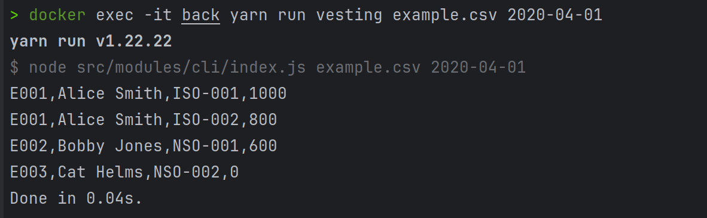
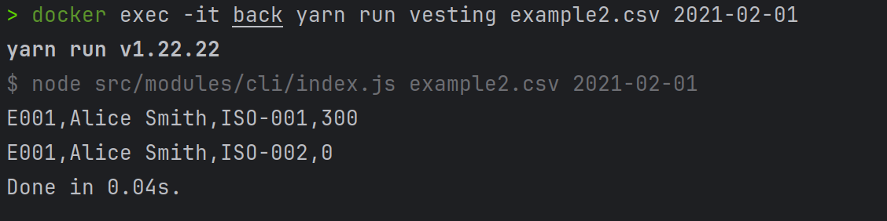
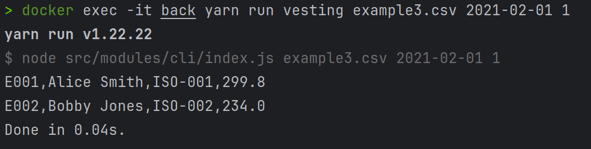
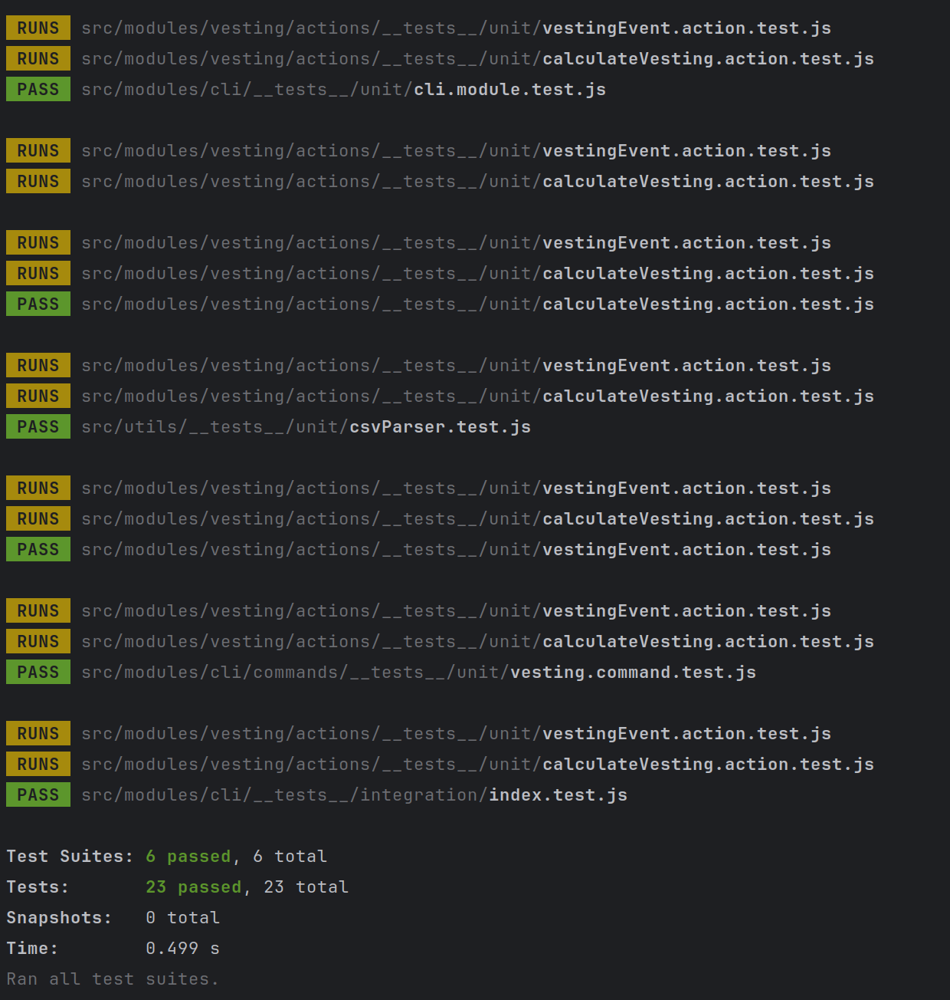
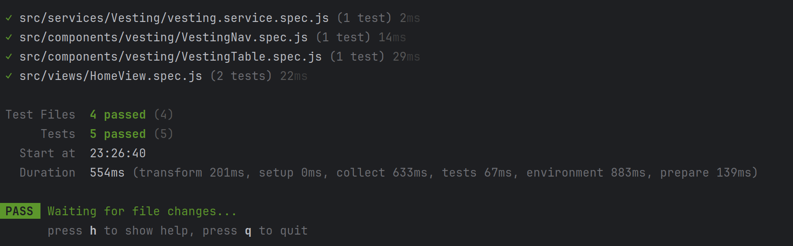

# 📜 Carta Take Home

## 📦 Installation & Setup

### 🐳 Running with Docker

#### Prerequisites

- Docker (version Docker version 27.5.1 or later)
- Node.js (version 20 or later)

#### Starting the Project

To start both the backend and frontend using Docker, run the following command:

```sh
docker compose up -d
```

This will build and start the containers for both projects.

- The frontend will be accessible at [**http://localhost:5173/**](http://localhost:5173/).
- The backend will be running inside a Docker container.

### 🖥️ Backend Setup

To run the CLI, access the backend container and execute the desired command. Follow these steps:

#### Accessing the Backend Container

for the backend container, run the following command:
```sh
docker exec -it back sh
```

for the frontend container, run the following command:
```sh
docker exec -it front sh
```

before sh you can use bash copy the command you want.

#### Running Commands Inside the Container

```sh
yarn run vesting example.csv 2020-04-01
yarn run vesting example2.csv 2021-02-01
yarn run vesting example3.csv 2021-02-01 1
```

or you can run directly with docker-compose

```sh
docker exec -it back yarn run vesting example.csv 2020-04-01
```



```sh
docker exec -it back yarn run vesting example2.csv 2021-02-01
```


```sh
docker exec -it back yarn run vesting example3.csv 2021-02-01 1
```



#### Command Syntax

```sh
yarn run vesting <file_name> <date> <?precision>
```

Where:

- **file\_name**: The CSV file to be processed.
- **date**: The reference date in `YYYY-MM-DD` format.
- **precision** *(optional)*: The number of decimal places for output (default is an integer, range: 0-6).

## 📌 Backend

### 📖 Overview

The backend is developed in **JavaScript using Node.js** without additional libraries. It processes large files efficiently using **streams**, handling each line individually to minimize memory consumption.

### 🛠 Design Decisions

- **Modular Architecture**: Each module (e.g., `vesting`, `cli`, `utils`) is isolated for scalability and maintainability.
- **Data Transfer Objects (DTOs)**: Ensures data validation before processing.
- **Entity-Based Approach**: Ensures consistency and validation of data.
- **Action-Oriented Design**: Keeps the code structured and maintainable.
- **Test-Driven Development (TDD)**: The codebase follows TDD principles to ensure quality, maintainability, and scalability.
- **SOLID Principles**: The entire architecture adheres to **SOLID** principles for better maintainability and extensibility.

### 📝 Assumptions & Interpretations

- **Command Execution**: Requires at least two parameters: `<file_name>` and `<date>`.
- **File Validation**: Only **CSV files** are accepted; other formats are rejected.
- **Date Validation**: The date must be in `YYYY-MM-DD` format; otherwise, an error is thrown.
- **File Content Rules**:
    - The file content must be in **CSV** format.
    - Each row must contain **at least six fields** to be processed; otherwise, it is ignored.
- **Ignored**:
    - If an invalid calculation occurs, the system ignores it and returns **quantity = 0**.
    - If a row’s date is **after the filter date**, its shares are ignored (**quantity = 0**).
    - The system will output the ignored employees and their awards.
- **Precision Handling**:
    - The precision parameter is **optional**; if omitted, values are treated as integers.
    - Precision values **below 0** or **above 6** are not allowed.

### 🚀 Potential Improvements

- **Batch Processing**: Process files in smaller chunks to reduce memory usage.
- **Parallel Processing**:
    - Utilize **worker threads** to speed up file processing.
    - Distribute processing across multiple machines to handle very large files efficiently.

### 🧪 Tests

The backend is thoroughly tested using **Jest** for unit and integration tests.

You can run the tests using the following command

```sh
docker exec -it back yarn test
```



## 📌 Frontend

### 📖 Overview

I have developed using Vue.js with vite. fetching data from the mock api.


### 🛠 Design Decisions

- Component-Based Architecture: The application is divided into reusable components (VestingNav, VestingTable, etc.) to enhance maintainability and scalability. Each component is responsible for a specific part of the UI, making the codebase easier to manage and extend.
- View Management: The view (HomeView.vue) integrates various components and manages the state of the application using the Vue store. It ensures that the UI is updated dynamically based on user interactions and state changes.
- State Management: Utilizes Vue's reactive store to manage the global state of the application. This approach ensures that changes in the state are automatically reflected in the UI, providing a seamless user experience.
- Service Layer: Implements a service layer (VestingService) to handle API calls and data processing. This separation of concerns allows for cleaner code and easier maintenance, as the data fetching logic is decoupled from the components.

### 📝 Assumptions & Interpretations

- none 

### 🚀 Potential Improvements

- create tests e2e with cypress
- Micro Front-End Architecture: Implement a micro front-end architecture to break down the application into smaller, more manageable parts.

### 🧪 Tests

The frontend is thoroughly tested using **Vitest** for unit and integration tests.

You can run the tests using the following command

```sh
docker exec -it front yarn test
```

